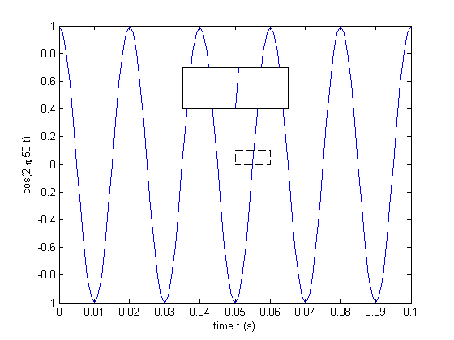

matlab-zoomPlot
===============

Added a zoom in plot to an existing plot. The location to be magnified as well as the location of the zoom-in plot can be specified through input parameters.

**todo**
 - provide handle to axes as input 
 - first select the zoom area (default plot to upper right corner) 
 - the attach mouse action listener to the two rectangles. 
 - resize and move based on mouse action.
 - 3D plot? 

Desired feature/usage: 

1. user calls a function with the handle of an axes (or figure)  
2. user is then prompted to select an area which is to be zoomed in
3. afterwards, user is prompted for the area which the zoom-in plot is placed 
4. Both boxes should be configurable, _e.g._, can be resize, moved, or styled differently. (probably have their handle returned as output so we can just set.). 
5. 
